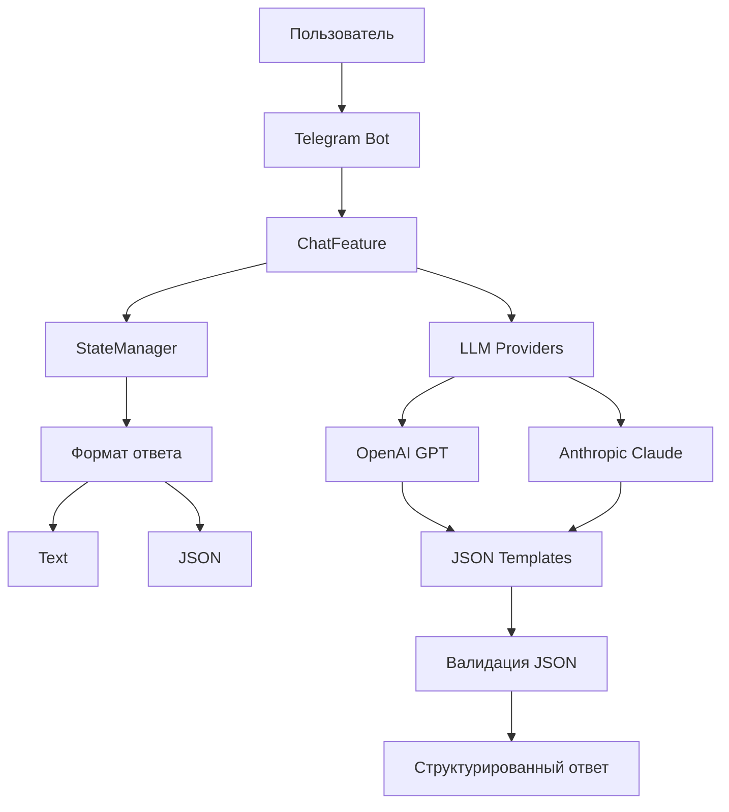

# План фиксации функции переключения формата ответа

## Текущее состояние проекта

Проект уже содержит реализованную функцию переключения формата ответа между текстовым и JSON. Основные компоненты:

### 1. Система управления состоянием
- **StateManager** в `src/features/day_01/chat_feature.py` - управляет форматом ответа для каждого пользователя
- Поддерживает два формата: "text" и "json"
- Хранит состояние в памяти (в будущем можно добавить персистентность)

### 2. Шаблоны для JSON-ответов
- `src/llm/templates/json_templates.py` содержит:
  - `get_json_system_prompt()` - system prompt для JSON-формата
  - `get_json_response_template()` - шаблон JSON-ответа
  - `format_prompt_for_json_response()` - форматирование промпта
  - `validate_json_response()` - валидация JSON-ответов

### 3. DTO классы
- `src/llm/dto/json_response.py` - JSONResponse для структурированных ответов
- `src/llm/dto/openai.py` - OpenAI DTO
- `src/llm/dto/anthropic.py` - Anthropic DTO

### 4. Провайдеры LLM
- `src/llm/providers/openai_gpt.py` - поддерживает JSON-формат через `generate_json_response()`
- `src/llm/providers/anthropic_claude.py` - аналогичная реализация

### 5. ChatFeature
- Команды: `/json-формат` и `/без формата`
- Inline клавиатура для переключения формата
- Интеграция с StateManager

## Компоненты для фиксации

### Основные файлы:
1. `src/features/day_01/chat_feature.py` - основная реализация
2. `src/llm/templates/json_templates.py` - шаблоны и валидация
3. `src/llm/dto/json_response.py` - DTO для JSON-ответов
4. `src/llm/providers/openai_gpt.py` - OpenAI провайдер
5. `src/llm/providers/anthropic_claude.py` - Anthropic провайдер

### Вспомогательные файлы:
6. `src/llm/base.py` - базовый класс LLM
7. `src/utils/typing.py` - типы данных
8. `src/config.py` - конфигурация

## Диаграмма архитектуры



## Коммит-сообщение

```
feat: Реализована функция переключения формата ответа (текстовый/JSON)

- Добавлен StateManager для управления форматом ответа пользователей
- Реализованы шаблоны и валидация JSON-ответов
- Обновлены провайдеры OpenAI и Anthropic для поддержки JSON-формата
- Добавлены команды /json-формат и /без формата
- Создана inline клавиатура для переключения формата
- Интегрирована система форматов в ChatFeature
```

## Тестирование

Для проверки работы функции:
1. Запустить бота
2. Использовать команду `/json-формат` для переключения в JSON режим
3. Отправить запрос - должен получить структурированный JSON ответ
4. Использовать команду `/без формата` для возврата к текстовому формату
5. Отправить запрос - должен получить обычный текстовый ответ

## Возможные улучшения (для будущих коммитов)

1. Добавление персистентности StateManager (база данных)
2. Расширение форматов ответа (XML, YAML и т.д.)
3. Кеширование шаблонов и валидаторов
4. Логирование и мониторинг использования форматов
5. Адаптивный выбор формата на основе контекста